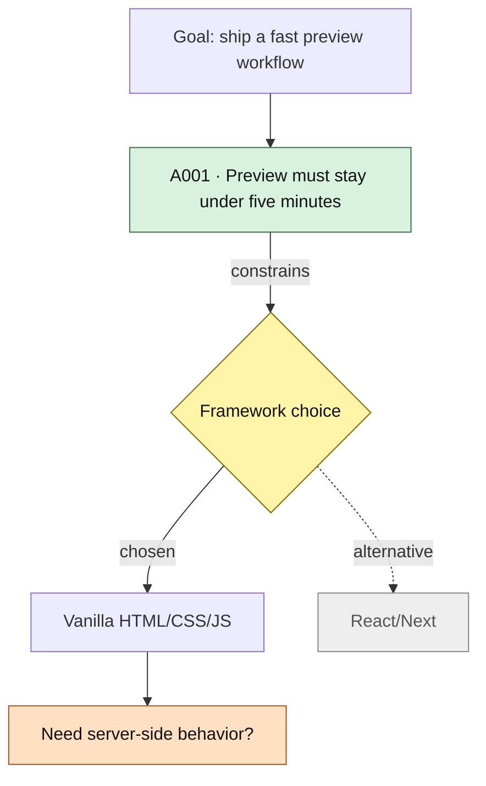
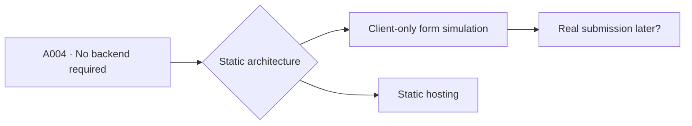
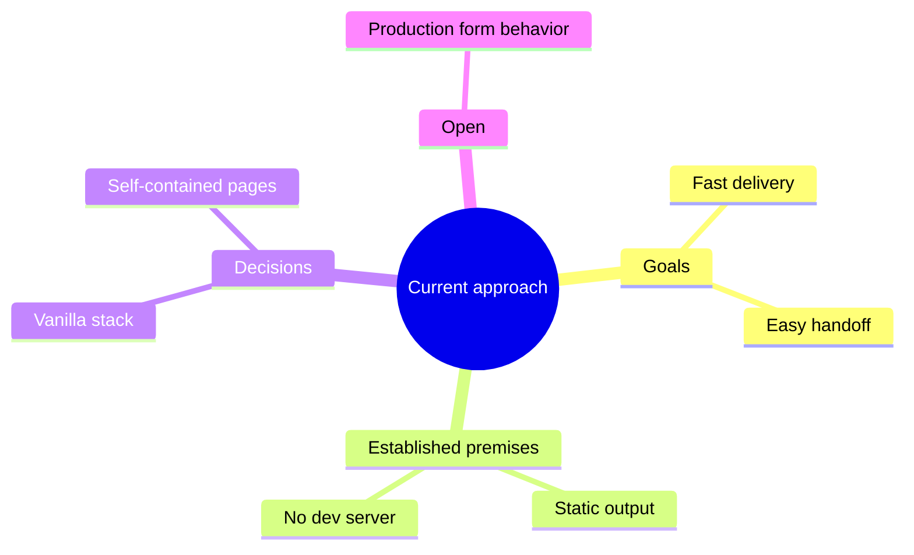

# Reasoning Graph / Mind Map

The graph is a compact audit map of **observable reasoning structure**: goals, evidence, premises, decisions, alternatives, dependencies, and open questions.

It is not a request to expose hidden chain-of-thought. Do not invent private intermediate reasoning. Reconstruct only what is supported by conversation, project artifacts, recorded assumptions, and explicit decisions.

## What the graph should reveal

A useful graph lets the user answer:

- What are we ultimately trying to accomplish?
- Which constraints shaped the approach?
- Which premises are load-bearing?
- Which choices followed from them?
- Which alternatives were actually considered?
- Which alternatives are only plausible reconstructed branches?
- What would change if an upstream premise changed?
- Where are the unresolved forks?

## Node vocabulary

Use a small semantic vocabulary:

| Prefix | Meaning | Mermaid shape |
|---|---|---|
| `G` | Goal / desired outcome | rectangle |
| `E` | Evidence / observed constraint | rounded rectangle |
| `A` | Assumption / premise | rectangle |
| `D` | Decision / fork | diamond |
| `P` | Chosen path / implementation | rectangle |
| `ALT` | Alternative path | rectangle |
| `Q` | Open question / uncertainty | hexagon or rectangle |

IDs in the Mermaid graph do not need to match JSON IDs except assumption/decision nodes that already have durable IDs. Prefer durable IDs where available.

## Edge semantics

Label edges when the relationship is not obvious:

- `supports`
- `constrains`
- `depends on`
- `led to`
- `chosen`
- `rejected because ...`
- `superseded by`
- `unresolved`

Avoid fake numerical “weights” unless the project actually recorded quantitative weights. A made-up `0.8` is false precision.

## Confidence / status styling

Prefer classes so the diagram remains readable:



If the rendering environment does not support styles well, preserve semantic labels in node text rather than relying on color alone.

## Historical honesty

There are three different things that can look like an “alternative”:

1. **Discussed alternative** – explicitly considered in conversation/docs.
2. **Observed abandoned path** – code/git/project artifacts show it existed.
3. **Reconstructed alternative** – a plausible branch generated during audit to explain the decision space.

Label #3 explicitly. Never present it as historical fact.

Example:

```mermaid
D1 -.->|reconstructed alternative| ALT2[Keep existing architecture]
```

## Building the graph

### Step 1: choose the root

Use the highest-level active goal relevant to the current project/task. If several unrelated goals exist, create separate subgraphs rather than forcing one fake root.

### Step 2: place load-bearing premises

Add only premises that actually influence a decision or interpretation. A graph containing every ledger item becomes useless.

### Step 3: add decision forks

For each important current approach, ask what observable decision selected it. If no decision is evidenced, connect the premise directly to the path and avoid inventing a diamond.

### Step 4: preserve alternatives

Show meaningful alternatives when supported. Gray/dashed edges work well for abandoned or nonchosen branches.

### Step 5: expose uncertainty

OPEN assumptions and unresolved questions should be visually obvious and connected to the downstream nodes they could change.

### Step 6: mark supersession

If a later decision replaced an earlier one, keep both and connect them with `superseded by` rather than erasing history.

## Dependency view

When the user asks “what breaks if we change X?”, generate a dependency-focused graph rather than the entire project history.

Example:



Then explain the smallest set of downstream decisions that need reconsideration.

## Mind-map option

If the user specifically asks for a **mind map**, Mermaid `mindmap` is acceptable when supported:



Use `flowchart` by default for causal/decision history because edges carry more meaning. Use `mindmap` for a conceptual overview.

## Graph persistence

When graph mode modifies state:

1. write the raw Mermaid body to `REASONING.mermaid`;
2. embed the same current graph in `COMMON-GROUND.md` under `## Reasoning Graph`;
3. preserve the prior graph only when it represented materially different historical state worth auditing;
4. update decision/alternative metadata in JSON only when supported by evidence.

## Conversational edits

Interpret requests naturally:

| User request | Action |
|---|---|
| “Expand this branch” | Add supported upstream/downstream detail around that node |
| “Why did we choose this?” | Show evidence and premises connected to the decision |
| “What if this assumption is wrong?” | Generate downstream dependency view |
| “We changed our mind” | Supersede the old decision/premise and regenerate |
| “Show only open questions” | Filter graph to uncertainty and affected decisions |
| “Mind map it” | Switch to conceptual `mindmap` representation |

## Keep it useful

A graph is too large when the user cannot understand the main decision structure at a glance. Collapse low-level implementation details into grouped nodes and expand them only on request.
